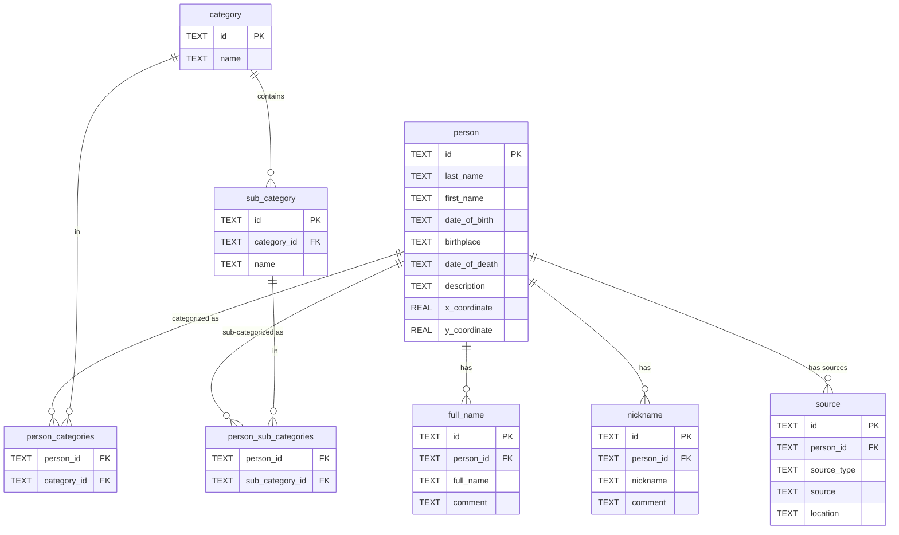

# Kaardirakendus - Eesti avalike tegelaste sünnigeograafia

Using vanillaJS in the client side and Fastify(TS) + MikroORM + SQLite in the server side. By default, firewall rules are configured to only allow traffic from Estonian IPs.

## Running the application locally
Create a database and add the hostname (sqlite_database.db) to `.env`

[Create tables](./src/assets/sql/create_tables.sql) inside the created db and then add [categories and sub-categories](./src/assets/sql/categories_and_sub-categories.sql)

**Local development**
Run `npm run start:dev` for development environment. Can set up your own API key in the `.env` file (project root).

**Build Docker image**
- **ARM:** Run `docker build -t geo-estonia-public-figs/prod .` in the projects root directory.
- **X64:** Run `docker build --platform linux/amd64 --no-cache -t geo-estonia-public-figs/prod .` in the projects root directory.

## Running the application via docker
Run with:
```shell
docker run -p 3001:3001 -v $(pwd)/kaardirakendus.db:/app/kaardirakendus.db -e NODE_ENV=production --env-file .env --name kaardirakendus-backend geo-estonia-public-figs
```

Mounts the database volume. There isn't any migration tools set upped, so exec into docker container and run the [sql scripts](./src/assets/sql/)

### SQLite configs

[//]: # (TODO automate the sqlite database stuff)

Download UUIDv4 extension:
```shell
wget -qO- "https://github.com/woile/sqlite-uuid/releases/download/0.4.0/libsqlite_uuid-$(uname -s)-$(uname -m).tar.gz" | tar xvz

# add to path
sudo mv libsqlite_uuid.so /usr/lib/

# load the plugin with each session
vim ~/.sqliterc
# add this line to file created above
.open database_name .db
.load libsqlite_uuid 
```

## Configuring a firewall
Solid and short explanation of [nftables](https://www.youtube.com/watch?v=83_M2NRgUtg) <br>
Can set up in the cloud providers UI. In this case using CLI for it (VM running on Debian 12 bookworm). Both `iptables` and `nftables` are possible options, using `nftables` in this instance:

Install `nftables`
```shell
sudo apt update
sudo apt install nftables
```

Enable `nftables`
```shell
# check status, if stopped or disabled, then enable and start
sudo systemctl status nftables

sudo systemctl start nftables
sudo systemctl enable nftables
```

Sample `nftables` ruleset file
```shell
#!/usr/sbin/nft -f

#
# table declaration
#
add table filter

table filter {
  chain incoming {
    type filter hook input priority 0; policy drop;
    
    # icmp
    icmp type echo-request accept
    
    # open tcp ports: sshd (22), httpd (80)
    tcp dport { ssh, http, https } accept
  }
}
```

Create `nftables` script
```shell
# copy contents from /scripts/create_nftables_estonian_ips_whitelist.sh
sudo vim create_nftables_estonian_ips_whitelist.sh

# give permissions and run the script
sudo chmod 744 create_nftables_estonian_ips_whitelist.sh
sudo ./create_nftables_estonian_ips_whitelist.sh

# make sure everything went alright, stdin the ruleset
sudo nft list ruleset

# see that the ruleset exists in /etc/nftables (press tab)
ls /etc/nftables #press tab
# nftables.conf           nftables_estonian.conf

# include the newly created conf to `nftables.conf` to persist the ruleset. Add the statement to the end of the file (right after the last curly bracket '}')
include "/etc/nftables_estonian.conf"

# reload the nftables conf
sudo systemctl reload nftables
```

## Database schema
